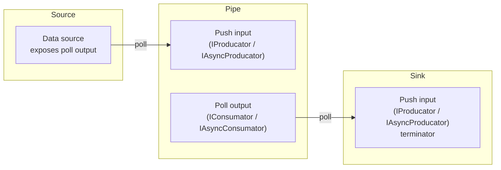

# Steelax.Pufflow

[](https://www.nuget.org/packages/Steelax.Pufflow)
[](https://www.nuget.org/packages/Steelax.Pufflow/)

**Pufflow** — a library for building dataflow pipelines based on **Poll** and **Push** data transfer models and their combinations.

---

## 📦 Installation

```
dotnet add package Steelax.Pufflow
```

---

## 🧠 Concept

The library defines **4 fundamental interfaces** for passing data between pipeline components:

### Poll (pull)

The Poll interface is the **read side** (output). Data is requested by the consumer.

| Synchronous | Asynchronous |
|------------|-------------|
| `IConsumator<T>` | `IAsyncConsumator<T>` |

```csharp
public interface IConsumator<T>
{
    ReadResult TryRead(out T value);   // non-blocking read
    bool WaitToRead();                 // blocking wait
}

public interface IAsyncConsumator<T>
{
    ReadResult TryRead(out T value);       // non-blocking read
    ValueTask<bool> WaitToReadAsync();     // async wait
}
```

### Push (write)

The Push interface is the **write side** (input). Data is sent by the producer.

| Synchronous | Asynchronous |
|------------|-------------|
| `IProducator<T>` | `IAsyncProducator<T>` |

```csharp
public interface IProducator<T>
{
    WriteResult TryWrite(T value);    // non-blocking write
    bool WaitToWrite();               // blocking wait
    void Complete(Exception? ex);     // completion / error signal
}

public interface IAsyncProducator<T>
{
    WriteResult TryWrite(T value);         // non-blocking write
    ValueTask<bool> WaitToWriteAsync();    // async wait
    void Complete(Exception? ex);          // completion / error signal
}
```

### Operation Results

**`ReadResult`** — a 3-state discriminated union:

| State | Meaning | implicit bool |
|-------|---------|:---:|
| `Ready` | Value successfully read | `true` |
| `Nothing` | No data yet, stream is still active | `false` |
| `Completed` | Stream has ended, no more data | `false` |

**`WriteResult`** — a 2-state discriminated union:

| State | Meaning | implicit bool |
|-------|---------|:---:|
| `Success` | Value successfully written | `true` |
| `Overflow` | Buffer is full | `false` |

Both results implicitly convert to `bool` for convenient use with `[MaybeNullWhen(false)]`.

---

## 🏗️ Pipeline Components

Components in Pufflow fall into **3 roles**:



| Role | Marker Type | Description |
|------|-------------|-------------|
| **Source** | `Source<T>` | A component that **only emits** data (poll output) |
| **Sink** | `Sink<T>` | A component that **only accepts** data (push input) and terminates the pipeline |
| **Pipe** | `Pipe<TLeft, TRight>` | A transformer: **push input → poll output** |

### Sync/Async Markers

Explicit sync/async mode markers:

```csharp
// Sync / Async — zero-size structs
public struct Sync;
public struct Async;
```

Corresponding flow markers:

| Type | Description |
|------|-------------|
| `Source<T>` | Poll data source of type `T` |
| `Source<TKind, T>` | Source with `Sync` or `Async` tag |
| `Sink<T>` | Push data sink of type `T` |
| `Sink<TKind, T>` | Sink with `Sync` or `Async` tag |
| `Pipe<TLeft, TRight>` | Transformer `push-TLeft → poll-TRight` |
| `Pipe<TKind, TLeft, TRight>` | Transformer with `Sync` or `Async` tag |

---

## 🔌 How It Works

### 1. Define a component with the `[Flow]` attribute

```csharp
using Steelax.Pufflow;
using Steelax.Pufflow.Abstractions;

[Flow]
public class MySource
{
    // Source: emits integers via poll interface
    public IConsumator<int> GetConsumator(FlowContext ctx)
    {
        // ... implementation
    }
}

[Flow]
public class MyTransform
{
    // Pipe: accepts int via push, emits string via poll
    public IConsumator<string> Handle(IProducator<int> input, FlowContext ctx)
    {
        // ... implementation
    }
}

[Flow]
public class MySink
{
    // Sink: accepts string via push and terminates the pipeline
    public void Execute(IProducator<string> input, FlowContext ctx)
    {
        // ... implementation
    }
}
```

### 2. Source Generator produces `IFlowable<TFlow>`

At compile time, the `GetFlowGenerator` analyzes the component's public methods and generates an implementation of `IFlowable<Source<T>>` / `IFlowable<Pipe<TLeft, TRight>>` / `IFlowable<Sink<T>>`.

### 3. Connect components via `FlowExt`

```csharp
using static Steelax.Pufflow.FlowExt;

var pipeline = source
    .Next(transform)    // Source<T1> → Pipe<T1, T2> → Source<T2>
    .Next(sink);        // Source<T2> → Sink<T2> → Sink<T2>
```

### 4. Run the pipeline with `FlowSource`

```csharp
using var flowSource = new FlowSource(cancellationToken);

// Attach a component to FlowSource
var source = mySource.Attach(flowSource);   // Source<T>
```

---

## 🧩 Supported Combinations

Components can mix poll and push in any combination:

| Component | Push Input | Poll Output | Handler Method |
|-----------|:---------:|:----------:|----------------|
| Source | ❌ | `IConsumator<T>` / `IAsyncConsumator<T>` | `GetConsumator`, `GetEnumerator` |
| Source | ❌ | `IEnumerator<T>` / `IAsyncEnumerator<T>` | `GetEnumerator`, `GetAsyncEnumerator` |
| Pipe | `IProducator<T>` | `IConsumator<T>` | `Handle`, `GetConsumator` |
| Pipe | `IAsyncProducator<T>` | `IAsyncConsumator<T>` | `Handle`, `GetAsyncConsumator` |
| Pipe | `IProducator<T>` | `IAsyncConsumator<T>` | `Handle` |
| Pipe | `IEnumerator<T>` / `IAsyncEnumerator<T>` | `IConsumator<T>` / `IAsyncConsumator<T>` | `Handle`, `GetConsumator` |
| Sink | `IProducator<T>` / `IAsyncProducator<T>` | ❌ | `Execute`, `ExecuteAsync` |

> **Note:** `IEnumerator<T>` and `IAsyncEnumerator<T>` are standard .NET interfaces. Pufflow supports them as a special case of the poll model for compatibility.

---

## 🚰 Lifecycle Management

```csharp
// FlowSource provides cancellation for the entire pipeline
using var flowSource = new FlowSource();

// Create context with a cancellation token
using var flowSource = new FlowSource(cancellationToken);

// Manual cancellation
flowSource.Context.Cancel();

// Automatic cancellation on Dispose
flowSource.Dispose();
```

---

## 🧪 Current Status

| Feature | Status |
|---------|:------:|
| Async poll chain (`IAsyncEnumerator`) | ✅ Implemented |
| Async poll chain (`IAsyncConsumator`) | 🚧 In progress |
| Sync poll chain (`IConsumator`) | 🚧 In progress |
| Push chain (`IProducator` / `IAsyncProducator`) | 🚧 In progress |
| Poll↔Push combinations (Pipe) | 🚧 In progress |
| Source Generator (`[Flow]` → `IFlowable<>`) | ✅ Implemented |

---

## 📋 Requirements

- .NET 10.0+
- C# 13+

---

## 🛠️ Build

```
dotnet build
dotnet test
```
