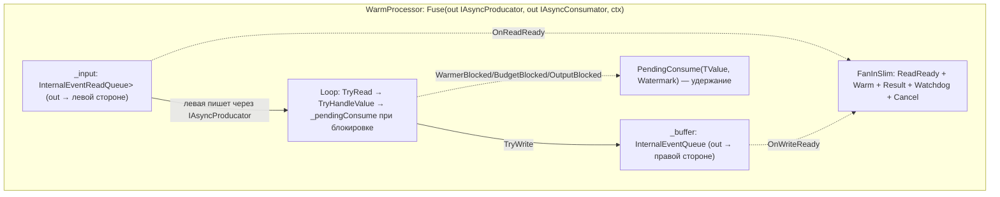

# План: единый формат контрактов `void Fuse(...)` вместо `Get*`

> Статус: **проектирование**.
> Цель: заменить разрозненные `GetEnumerator/GetAsyncEnumerator/GetConsumator/GetAsyncConsumator/GetProducator/GetAsyncProducator`
> на единый формат `void Fuse(...)` (source/sink/pipe), закрыть недостающую комбинацию pipe **push→pull**
> (нужна для `WarmProcessor` с push-входом через `EventReadQueue`).

---

## 1. Мотивация

Текущий формат хендлеров смешивает два стиля:

- **pull**-компоненты отдают/принимают объекты через `Get[Async]Xxx(...)`;
- **push**-компоненты регистрируют target через `Fuse(target, ctx)`.

Из-за этого **не выразима** комбинация «принимаю push-вход + отдаю pull-выход» (pipe push→pull),
которая нужна `WarmProcessor` (push-вход от Kafka-подобного источника, pull-выход к потребителю).

Единый формат `void Fuse(...)`:

- форма однозначно определяется **модификаторами параметров** (`in`/`out`) и числом flow-параметров;
- резолвер и генератор не строят имена `Get*` — ищут `Fuse` и смотрят сигнатуру;
- закрываются все комбинации: source / sink / pipe × pull / push / смешанные.

---

## 2. Целевая матрица сигнатур

| Роль | Форма | Сигнатура |
|---|---|---|
| pull-источник | `Source<X>` | `void Fuse(out I[Async]Consumator/Enumerator<X> src, FlowContext ctx)` |
| push-источник | `Source<X>` | `void Fuse(out I[Async]Producator<X> src, FlowContext ctx)` |
| pull-сток | `Sink<X>` | `void Fuse(in I[Async]Consumator/Enumerator<X> dst, FlowContext ctx)` |
| push-сток | `Sink<X>` | `void Fuse(in I[Async]Producator<X> dst, FlowContext ctx)` |
| pipe pull→pull | `Pipe<X,Y>` | `void Fuse(in I[Async]Consumator/Enumerator<X>, out I[Async]Consumator/Enumerator<Y>, FlowContext ctx)` |
| pipe push→push | `Pipe<X,Y>` | `void Fuse(in/out I[Async]Producator<X>, out/in I[Async]Producator<Y>, FlowContext ctx)` |
| **pipe push→pull** | `Pipe<X,Y>` | `void Fuse(out I[Async]Producator<X>, out I[Async]Consumator<Y>, FlowContext ctx)` ← **WarmProcessor** |
| pipe pull→push | `Pipe<X,Y>` | `void Fuse(in I[Async]Consumator<X>, out I[Async]Producator<Y>, FlowContext ctx)` |

> Соглашение: **первый** flow-параметр — сторона **входа** (что компонент потребляет),
> **второй** — сторона **выхода** (что отдаёт). Модификатор `out` = компонент создаёт/владеет
> объектом; `in` = компонент принимает готовый объект от конвейера.

---

## 3. Флаг `Out` в `FlowKind` и `params FlowKind[] kinds`

Для выражения направления каждого flow-интерфейса узла добавляется флаг `Out`:

```csharp
[Flags]
internal enum FlowKind : byte
{
    None = 0,
    Async = 1 << 0,
    Out   = 1 << 1,          // узел ОТДАЁТ этот flow-интерфейс (Fuse(out ...)); без него — принимает (in)
    Enumerator = 1 << 2,
    Consumator = 1 << 3,
    Producator = 1 << 4,
    ...
}
```

Фабрика узла становится универсальной:

```csharp
// было
FlowMeta Create(object instance, FlowKind inKind, FlowKind outKind)

// стало — kinds перечисляют все flow-интерфейсы узла по порядку Fuse-параметров
FlowMeta Create(object instance, params FlowKind[] kinds)
```

### Роль узла определяется числом kinds и флагом `Out`

| Роль | kinds |
|---|---|
| pull-источник | `[Consumator\|Out]` / `[Enumerator\|Out]` |
| push-источник | `[Producator\|Out]` |
| pull-сток | `[Consumator]` / `[Enumerator]` (без `Out`) |
| push-сток | `[Producator]` (без `Out`) |
| pipe pull→pull | `[Consumator, Consumator\|Out]` |
| pipe push→push | `[Producator, Producator\|Out]` |
| **pipe push→pull** | `[Producator, Consumator\|Out]` ← WarmProcessor |
| pipe pull→push | `[Consumator, Producator\|Out]` |

- **source** = 1 kind **с `Out`**;
- **sink** = 1 kind **без `Out`**;
- **pipe** = 2 kinds (вход без `Out` + выход с `Out`).

`FlowKindExtensions.Classify(type)` остаётся «чистым» (family+async, без `Out`) — направление
добавляет **узел** при построении kinds. `GetFlowInterface` не зависит от `Out` (тот же открытый
generic), `Out` лишь указывает модификатор параметра `Fuse`.

---

## 4. Изменения по слоям

### 4.1 Генератор `GetFlowGenerator`

Уже умеет `Fuse` с 1–2 flow-параметрами (`BuildFuseBasedInterface`, `GetHandlerTFlowTypeName`).
Доработки:

- для `Fuse(out, out, ctx)` и `Fuse(in, out, ctx)` — view-свойство `Flow<In>To<Out>` (уже есть для 2 params);
- проверить, что `IsFlowInterfaceType` различает `in`/`out` (для семантики source vs sink — по write/read);
- убрать ветки для `Get*` из `HandlerNames` после полного перехода (оставить только `Fuse`).

### 4.2 Runtime `FlowMetaNode.ResolveHandler`

Сейчас ищет имена `Get[Async]Enumerator/Consumator/Producator`. Новая логика — по `params kinds`:

```csharp
// Create(instance, params kinds) → NodeKind определяется kinds
// source = [kinds] == 1 && kinds[0].HasFlag(Out)
// sink   = [kinds] == 1 && !kinds[0].HasFlag(Out)
// pipe   = [kinds] == 2

// резолв Fuse по числу flow-параметров и их модификаторам (сверяем с kinds[i].Out)
NodeKind.Source:  FindMethod(type, "Fuse", 2, out: true)             // out flow, ctx
NodeKind.Sink:    FindMethod(type, "Fuse", 2, in: true)              // in flow, ctx
NodeKind.Pipe:    FindMethod(type, "Fuse", 3, in/out: ...)           // in/out flow, ctx
```

`ResolveTypes` — тип входа/выхода из параметров `Fuse` (не из return), сверяя с `kinds[i].Out`.

### 4.3 Runtime `FlowMetaNode.MergeNodes`

- `MergeSourcePipe` / `MergePipePipe` / `MergePipeSink` — вызывать `Fuse(...)` и передавать
  уже созданные объекты (буферы) через `in`, получать созданные через `out`.
- Для push→pull `WarmProcessor`: конвейер создаёт входной `EventReadQueue` (передаёт как `out`),
  создаёт/получает выходной `_buffer` (отдаёт как `out`), регистрирует цикл через `context.RegisterBackground`.

### 4.4 `FlowMarshal`

Убрать рефлексию по именам `GetAsyncEnumerator`/`GetExecuteAsync` — вызывать `Fuse` по сигнатуре.

### 4.5 `FlowExt.*` — перегрузки `Next`/`End`/`On`

- `On(flow)` — уже на `FlowSource` (без изменений).
- `Next`/`End` — должны принимать `IFlowable<Pipe<...>>`/`IFlowable<Sink<...>>`, где форма pipe теперь
  `Pipe<IAsyncProducator<X>, IAsyncConsumator<Y>>` (push→pull) и т.п.
- `FlowMetaNode.Create(right, params kinds)` — kinds строятся из типов pipe (`Classify` первого =
  вход без `Out`, второго = выход с `Out`).
- Добавить недостающие перегрузки для push→pull и pull→push pipe.

### 4.6 Компоненты (перевод на `Fuse`)

| Компонент | Было | Станет |
|---|---|---|
| `BufferProcessor` | `GetAsyncEnumerator(IAsyncEnumerator, ctx)` | `Fuse(in IAsyncEnumerator<X>, out IAsyncEnumerator<X>, ctx)` |
| `ChunkProcessor` | `GetAsyncEnumerator(IAsyncEnumerator, ctx)` | `Fuse(in IAsyncEnumerator<X>, out IAsyncEnumerator<Chunk<X>>, ctx)` |
| `TimeoutProcessor` | `GetAsyncEnumerator(IAsyncEnumerator, ctx)` | `Fuse(in IAsyncEnumerator<X>, out IAsyncEnumerator<Unio<X,AwaitTimeout>>, ctx)` |
| `MapProcessor` | `GetAsyncConsumator(IAsyncConsumator, ctx)` | `Fuse(in IAsyncConsumator<X>, out IAsyncConsumator<Y>, ctx)` |
| `KafkaConsumerProcessor` | `Fuse(IProducator, ctx)` | `Fuse(in IProducator<X>, ctx)` (сток, min-контракт) |
| **`WarmProcessor`** | `GetAsyncConsumator(IAsyncEnumerator, ctx)` | **`Fuse(out IAsyncProducator<Watermarked<TValue>>, out IAsyncConsumator<Unio<...>>, ctx)`** |

### 3.7 SDK-процессоры

- `SourceProcessors/*` (Enumerator/Consumator/Producator) → `Fuse(out ...)`.
- `SinkProcessors/*` (Enumerator/Consumator/Producator) → `Fuse(in ...)`.
- `TestSourceExtensions` / `TestSinkExtensions` — вызовы через `flow.On(...)` / `.Consume(...)` остаются,
  но внутри компоненты на `Fuse`.

### 3.8 Тесты

- `tests/Steelax.Pufflow.Tests/Flows/*` — `FlowSource*`, `FlowSink*`, `FlowPipe*` → `Fuse`.
- `tests/Steelax.Pufflow.Generator.Tests` — кейсы генератора под `Fuse`.
- `tests/Steelax.Pufflow.Operators.Tests` — `WarmProcessorTests` (push-вход), остальные.

---

## 4. `WarmProcessor`: push-вход + PendingConsume (в новом формате)



- `GetAsyncProducator(FlowContext)` / `GetAsyncConsumator(FlowContext)` заменяются на единый
  `Fuse(out IAsyncProducator<Watermarked<TValue>>, out IAsyncConsumator<Unio<...>>, FlowContext)`.
- Вход: `EventReadQueue` (событие `OnReadReady`, `WaitToWriteAsync` у производителя).
- Выход: `_buffer` остаётся (`EventWriteQueue`, `OnWriteReady` → `ResultSlot`), чтобы `OutputBlocked`
  корректно будился.
- Удержание: `PendingConsume` по аналогии с `PendingSegment`.
- Регистрация цикла: `context.RegisterBackground(() => InternalExecuteAsync(context))`.

---

## 5. Порядок работ

1. Определить сигнатуры `Fuse` для всех ролей (п. 2) — зафиксировать в коде.
2. Переписать `FlowMetaNode.ResolveHandler`/`ResolveTypes` под `Fuse`.
3. Упростить `FlowMarshal`.
4. Адаптировать `FlowExt.*` (Next/End) под `Fuse`-формы.
5. Адаптировать `GetFlowGenerator` (убрать `Get*`, оставить `Fuse`).
6. Перевести компоненты: Buffer → Chunk → Timeout → Map → Kafka.
7. Перевести `WarmProcessor` на push-вход + `Fuse(out,out)` + `PendingConsume`.
8. Перевести SDK-процессоры (Source/Sink).
9. Перевести тесты.
10. Собрать решение, прогнать все тесты.

---

## 6. Риски

- **Крупный рефакторинг ядра** (`FlowMetaNode`, `FlowMarshal`, генератор) — ломает всё сразу.
- **Смешанные формы** (`in,out`) требуют аккуратного определения «кто создаёт объект»:
  для `out` объект создаёт компонент, для `in` — конвейер.
- **Семантика буферов**: для push→pull входной и выходной буферы создаёт сам компонент (`out`),
  конвейер лишь связывает их с соседями.
- **Тесты генератора** чувствительны к именам хендлеров — нужно обновить ожидания.
